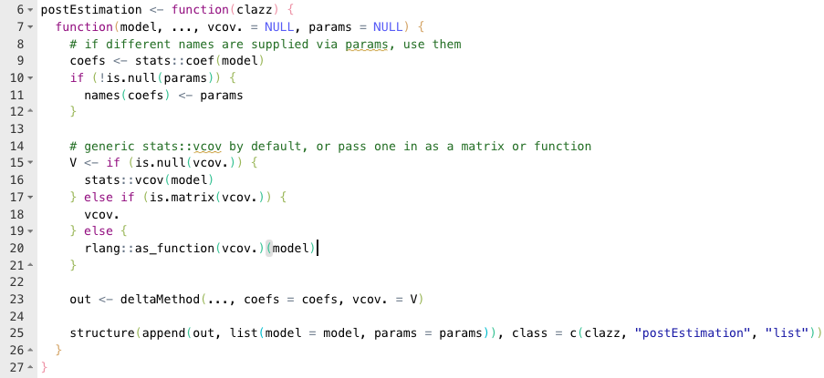
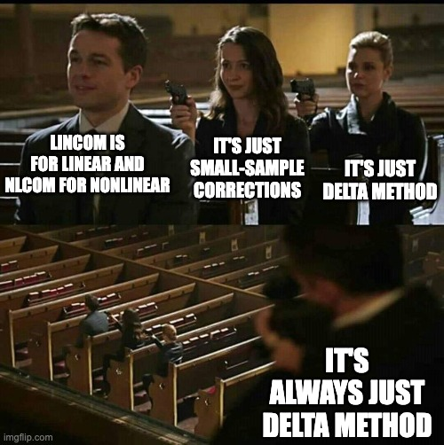
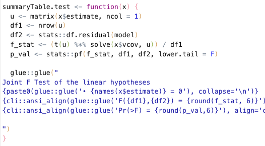

```{r setup, include=F}
options(tidyverse.quiet = TRUE)
devtools::load_all()
```

## The Pattern

After fitting our linear model, we often want to ask questions about combinations of the $\beta$s. Are two of them equal, are these three equal to zero, is $\tanh \beta_3$ equal to zero? This is broadly known as post-estimation.

I endorse the <span style="font-variant:small-caps;">It's All Delta Method™</span> view of post estimation testing. Recall the Delta Method says that if

- $X$ is a k-dimensional multivariate random normal with mean $\mu$ and covariance matrix $\Sigma$ 
- $g:\mathbb{R}^k \rightarrow \mathbb{R}^l$ has a non-zero $l\times k$ derivative matrix, call it $\nabla\! g$

Then we can approximate the distribution of $g(X)$ as normal with mean $g(\mu)$ and variance $\nabla\! g(\mu) \Sigma \nabla\! g(\mu)'$. This is basically a first-order approximation to the distribution using a Taylor series. Like in a Taylor series, if $g$ is linear (i.e. $g(x) = Ax$ for some matrix $A$), then this is not just an approximation, it is *exact*.

Second, remember that we can choose to evaluate multiple hypotheses either jointly or independently. If we evaluate them independently, we read the standard errors off the diagonal of the variance matrix and construct a bunch of t- or z-values. If evaluate them jointly in order to test that $g(\mu)=0$, we construct the chi-square type of statistic by combining all of the hypotheses together into one value. We do that by pre- and post-multiplying the point estimates around the inverse variance matrix, i.e.
$$
g(\mu)' (\nabla\! g(\mu) \Sigma \nabla\! g(\mu)') ^ {-1} g(\mu) \sim \mathcal{\chi}^2_l
$$

In conclusion, you have two questions: is my function linear, and am I testing jointly or independently? The four possible combinations give you the four Stata commands used in post-estimation: **test**, **testnl**, **lincom**, and **nlcom**. They all have to perform Delta Method to estimate the distribution of $g(X)$, but the only difference is what you do with that once you get it:

|                 | Linear                    | Nonlinear                          |
| ---------------:|---------------------------| -----------------------------------|
| **Independent** | `lincom` Do a t-test   | `nlcom` Do a z-test             |
| **Joint**       | `test` Do an F-test    | `testnl` Do a chi-square test   |

Clear as mud? Let's do an example.

## The Implementation

The 0.2.0 release of my code has Stata-esque post-estimation in it. Let's start by estimating our favorite model, returns to wage based on education and ability score:
```{r}
library(tidyverse)
library(haven)
library(fixest)

htv <- read_dta(system.file("HTV.DTA", package = "metrics.in.r"))

(model <- feols(lwage ~ educ * abil, data = htv, vcov = "hc1"))
```

Let's suppose that we are interested in the partial effect of education on wages at different levels of ability. The partial effect is $\beta_{educ} + abil * \beta_{educ * abil}$. It depends on the ability level. Let's calulate the 25^th^, 50^th^, and 75^th^ percentiles of ability

```{r}
abil_25 <- quantile(htv$abil, 0.25)
abil_50 <- median(htv$abil)
abil_75 <- quantile(htv$abil, 0.75)
```

The first thing we might try is lincom, which will give us a point estimate of each of these partial effects.

```{r, results="none"}
library(metrics.in.r)

lincom(model,
    educ + abil_25 * `educ:abil`,
    educ + abil_50 * `educ:abil`,
    educ + abil_75 * `educ:abil`
    )
```

Some explanation is warranted here. First, `educ` and `` `educ:abil` `` refer to coefficients in the model. I always look there first for values, and then your global environment. Second, the backticks on `` `educ:abil` `` are required because it's a "weird" R expression and writing backticks tells R to consider that as one single variable. You would have to do that to test `` `(Intercept)` `` as well.

One improvement (I think) that may make this easier: We can rename our betas. The names of our coefficients are currently
```{r}
names(coef(model))
```

But we can use the `glue` package to generate simpler names:
```{r}
library(glue)

lincom(model,
    b2 + abil_25 * b4,
    b2 + abil_50 * b4,
    b2 + abil_75 * b4,
    params = glue("b{1:4}") # equal to c("b1", "b2", "b3", "b4")
    )
```

Now let's use the `test` command. This tests that all of the expressions you supply are equal to zero. Let's test if the coefficients on `educ` and `abil` are equal to each other (i.e. $\beta_{educ} - \beta_{abil} = 0$)

```{r}
test(model, educ - abil)
```

The commands for nonlinear functions work the same, but you can use funky functions:

```{r}
nlcom(model, sin(educ), sqrt(abil))
```

You can also supply your own `vcov` for the betas if you want. This can be a function or a matrix.

```{r}
library(sandwich)
model %>% test(educ - abil, vcov. = vcovHC(., type = "HC1"))
```

Lastly, I should note that the default behavior with robust standard errors is to use the generic `stats::vcov` function. That means that `lm()` objects are homoskedastic by default, but `feols` and `lm_robust` objects will use the robust standard errors by default.

## The Nitty Gritty: It Really All is Delta Method

If you go into my [code](https://github.com/nateybear/metrics-in-r/tree/main/R) and look at the definitions of these functions, it may seem weird:

```{r, eval = FALSE}
test <- postEstimation("test")
tesnl <- postEstimation("testnl")
lincom <- postEstimation("lincom")
nlcom <- postEstimation("nlcom")
```

That's it! Why so simple? What is the `postEstimation` function? Here is the code:



First, note that `postEstimation` is a function that returns a function, sometimes known as a **function factory**. Note that the argument, `clazz`, is only used right at the end, on line 25. What is the rest of the function doing?

Lines 8–21 are just some housekeeping. If you give me the `params` argument, change the names of my coefficient vector to match it. In lines 15–21 I'm just resolving the covariance of the betas given the different options for supplying it. The real work is line 23, the `deltaMethod`. 

The `deltaMethod` function returns the point estimate and covariance of the post-estimation hypotheses. How is a bit of digression... I refer the interested reader to the [metaprogramming](https://adv-r.hadley.nz/metaprogramming.html) chapter of Advanced R and to the [reference page](https://stat.ethz.ch/R-manual/R-devel/library/stats/html/deriv.html) on basic symbolic differentiation in R. The point is, it's all just Delta Method.



The only difference between all of the post-estimation commands is the class of the returned object. Then I just write a specialized method for each one that returns a summary table, for example `test`. This is where I calculate the f-statistic, just when the object is printed out.



I really want to emphasize the point that all of the post-estimation commands RETURN THE EXACT SAME OBJECT. What is printed to the screen differs for each command, but the underlying object is the exact same.

## Conclusion

Hopefully this gives you a starting point for doing this in R. Keep in mind the two distinctions: whether it is linear or nonlinear, and whether you are jointly or independently testing your hypotheses. This will lead to pick one among `test`, `testnl`, `lincom`, or `nlcom`. It's all Delta Method, but the particular test statistic that we choose will be different for each one.

Why did I write this code myself? Surely there are other ways to do post-estimation in R. The only problem is that I have not found one that works as seamlessly as Stata does. The `car` package has `deltaMethod` and `linearHypothesis` functions, and the `aod` package has a `wald.test` function. You could definitely stitch them together to get the job done. My issue is that the difficulty of stitching them together is a friction that drives people away from R towards Stata. I want to smooth the bumps and make it easier for people to stop paying through the nose for mediocre software. So hopefully my code helps you.

<hr/>

Happy Coding!
