I want to delay a more detailed discussion of RMarkdown for later in the year. However, you need to know the basics in order to do your homeworks in R. So this week, we will take a digression from the theme of how to do estimators in R to talk about how to *write* about the estimators that you do in R.

## The Pattern: Literate Programming

Literate Programming is concept that is almost forty years old—not much older than modern computing itself. It was pioneered by the famous computer scientist Donald Knuth. He has a quote about literate programming that sums it up perfectly:

> Instead of imagining that our main task is to instruct a computer what to do, let us concentrate rather on explaining to human beings what we want a computer to do.

In literate programming, our primary output is a report, presentation, or some other document that is intended for human consumption. However, we are able to scatter chunks of computer code throughout our document, which is then executed and the output interleaved in the document. That means there are "processing" steps of turning literate programs into finished output. These are typically called "tangling," which is extracting the computer code from your document and executing it; and "weaving," which is inserting the results of that execution into the document and compiling to a finished output. The entire process of tangling and weaving is sometimes called "knitting."

## The Horror: It's LaTeX 😱

Due to the historical context that literate programming evolved in (and due to the fact that Donald Knuth invented LaTeX), most literate programs have used LaTeX and produced PDF documents as output. That's still the case today, as there's not really a better engine for generating PDFs for academic reports. For the uninitiated, LaTeX is a programming language for producing documents—think "if Microsoft Word were a programming language."

LaTeX can be intimidating to newcomers, and there definitely is a learning curve. Fortunately, there are ways that we can "abstract" away the difficulties of working with LaTeX and write our document using a much simpler [markdown](https://www.markdownguide.org/) syntax. Our markdown is then converted into LaTeX and we make pretty PDFs.

The upshot is that you need to install LaTeX on your computer. RMarkdown creator Yihui Xie has done a lot of work to try and make this easy for R users. He has an R package called `tinytex` for downloading a minimal version of LaTeX. You can check that out [here](https://yihui.org/tinytex/). The downside is that it may not contain the LaTeX packages that you need. It is not too hard to install new LaTeX packages, just kind of annoying. 

The other option is to install what is called a "LaTeX distribution," which is LaTeX plus a bunch of other packages, applications, etc. These are large and can take up 6+ GB of memory on your computer. The upside is that there are more LaTeX packages than you will ever use in your life included, so you are spared the annoyance of installing missing LaTeX packages. You can read more on LaTeX distributions [here](https://www.latex-project.org/get/).

## Introducing RMarkdown

Now that we understand a little bit about the mechanics of literate programming, let's introduce RMarkdown. You will need to install one additional R package, `knitr`. This package does all of the business of compiling our documents.

To create a new RMarkdown file, select the dropdown in the top left corner of RStudio:

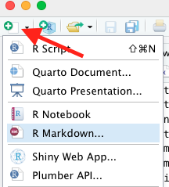

Choose a name for your document, and make sure that the output type is PDF. You will have a document generated with some example commands to show you what you can do with RMarkdown. We will delete most of this and keep two things:

1. The header, also called the metadata. It starts and ends with three dashes, `---`. Here you can set different properties of your document, including controlling how the output is generated. We will come back to this in a second.
2. The setup code chunk, which is R code that "sets up" your environment for the rest of the RMarkdown document. This is a good place to set default `knitr` options, or to load all of the libraries you'll be using.

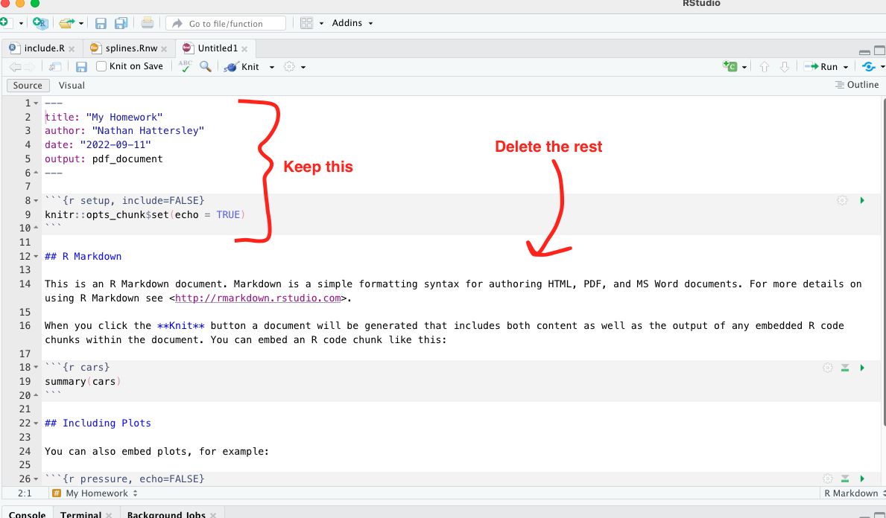

In order to create a PDF, you just need to click the "knit" button on the toolbar. A PDF preview will open up in a separate window once your document knits.

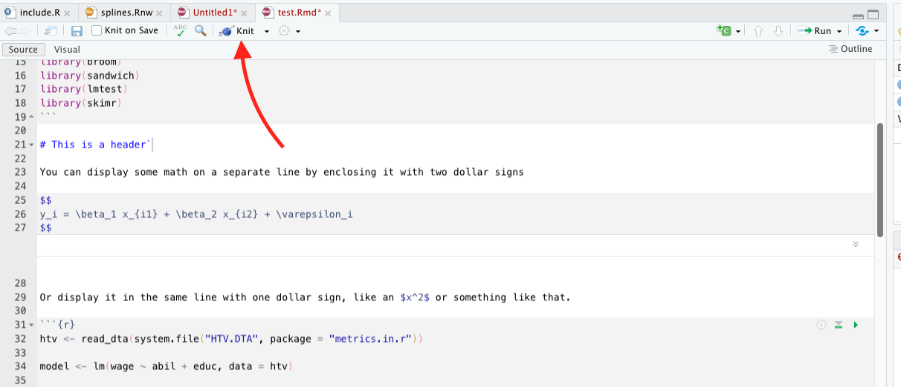

## What can I do with RMarkdown?

### Markdown syntax and math equations

Markdown syntax itself is pretty easy to work with. Different special symbols tell markdown that text should be formatted in certain ways. You can create headers, create lists, *italicize* things, **bold** them, create links, insert images, and more. There are many cheatsheets that you can Google, here is [one](https://www.markdownguide.org/cheat-sheet/) as an example. A quick flavor of markdown is below.

::: {.card}
::: {.card-header}
##### This markdown code
:::
::: {.card-body}
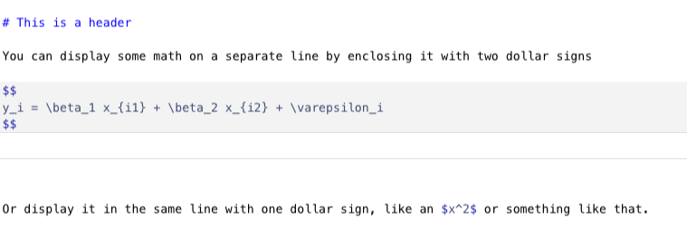
:::
:::

<br/>

::: {.card}
::: {.card-header}
##### Produces this PDF output
:::
::: {.card-body}
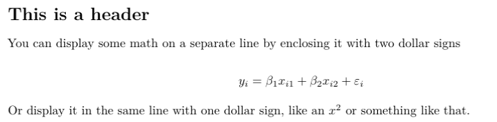
:::
:::

The math equations that I wrote above are actually LaTeX equations. Since we are eventually turning this markdown file into LaTeX, we can also just include LaTeX directly such as in this case. A nice cheatsheet on math symbols in LaTeX can be found [here](https://github.com/manuelemacchia/math-latex/raw/master/amsmath.pdf).

### R Code Chunks

You can create a "code chunk" by inserting three backticks and then curly braces with the letter R in it, like so:

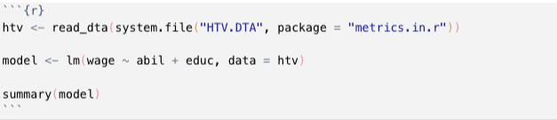

Three more backticks terminates the code chunk. (Hot tip: The letter "r" is the language of the code chunk, you can also use "python" or "julia" as the language if you want.)

What happens when you knit the document is the the R code is displayed in the document, and the results of executing the R code are displayed below. All of the code chunks are run linearly, so you can include variables that you have defined in previous code chunks. The output of the code chunk above is this:

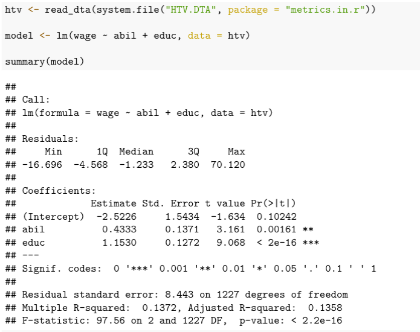

You can include options to control how the code chunk is evaluated, like so:

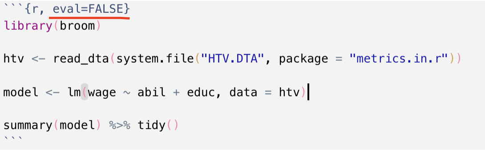

Some good ones to know are

- `eval = FALSE` if you want to display the code but not actually run it
- `echo = FALSE` if you want to run the code and show the output but not show the code itself

There are many more options you can add, such as control plot size and adding captions to plots. You can see them all at Yihui's website [here](https://yihui.org/knitr/options/#chunk-options).

## Two Tricks Before You Go

There is a way to "pretty print" data frames in RMarkdown. This means that any code chunk that returns a data frame will be passed to a special print method that makes it a nice LaTeX table. I'll show two examples below. To enable this, change your header to look like this:

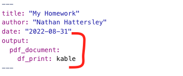

### Tidy Your Regression Output

There is a library called `broom` in R that will tidy your regression summaries and turn them into data frames. You just pass either a result from `summary` or `coeftest` into the `tidy()` function, like so:

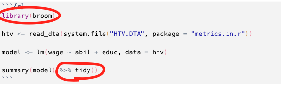

Because we changed the header, we will now pretty print the regression summaries, like so:

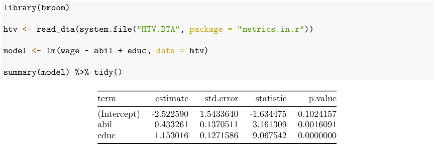

Note that for the output of `summary()` commands, this will only print the coefficient table, not the R squared, F statistic, or MSE. So if that matters to you, consider a different way of presenting your model summary.

### Easy Summary Statistics

The `skimr` library implements a great utility to print descriptive statistics for your datasets. The function that we want to use is called `skim_without_charts`. It produces output that looks like this (with pretty printing enabled):

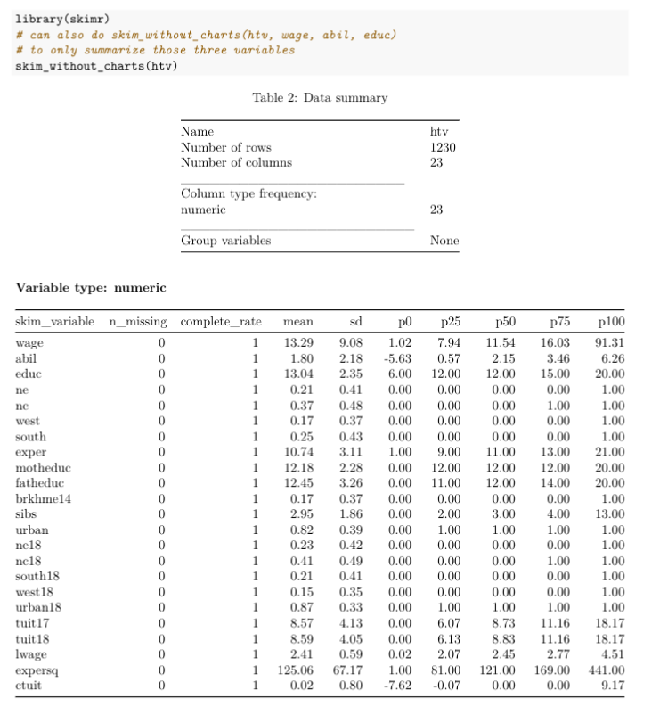

Each row of the output is a different variable in `htv`, and the columns present different summary statistics. Remember that `p0` is the minimum, `p50` is the median, and `p100` is the maximum.

Instead of summarizing the entire dataset, you could list only the variables you want to summarize, like so:

```{r, eval=F}
htv %>% skim_without_charts(wage, abil, educ)
```

## Conclusion

Hopefully this gives you enough information to get started using RMarkdown in your homeworks. In general, RMarkdown provides us with a clean, relatively painless way to do literate programming. Remember that markdown *becomes* LaTeX *becomes* a PDF.

There are many good resources for learning RMarkdown. There is an entire book on it available for free [online](https://bookdown.org/yihui/rmarkdown/), as well as a [cookbook](https://bookdown.org/yihui/rmarkdown-cookbook/) which gives solutions or "recipes" for common tasks. There is also a cheatsheet available for it [here](https://www.rstudio.com/resources/cheatsheets/). I should point out that there are many cheatsheets on topics besides RMarkdown available at that link, and they are all extremely handy. If you're a technical reader, the detailed reference for RMarkdown is [here](https://rmarkdown.rstudio.com/docs/reference/index.html).

## Postscript: Other document types? Other outputs?

First, I should say that RMarkdown can output a lot more than PDFs. It can create blogs, books, websites, HTML pages, PowerPoint presentations, interactive (Shiny) documents, and more. That's beyond the scope of my article, but you can find many resources on the different output types at the links I provided above.

Second, there are some other "literate programming" document types that you may have heard of, namely `.Rnw` and `.qmd`. Rnw stands for "R noweb" and is older than RMarkdown—it goes back to the system designed by Donald Knuth. It is literally a LaTeX document, with some R code sprinkled in. You can see an example in the `splines.Rnw` document I posted to Canvas if you're interested. If you're already proficient in LaTeX, you might like the amount of control that it gives you. I don't like the size of the learning curve, so I prefer to teach `.Rmd` first.

The `.qmd` file extension stands for "Quarto Markdown." RStudio announced this year (2022) that they are rebranding as Quarto and releasing a new literate programming tool called Quarto Markdown. It de-emphasizes R and is intended for a multi-lingual data science audience who can produce documents using any language. This will eventually be the replacement for RMarkdown, but my opinion is that it is still a bit new. Once they have more documentation and a bigger user base, it will be more beginner friendly and I will start teaching it instead of RMarkdown.

<hr/>

Happy Coding!