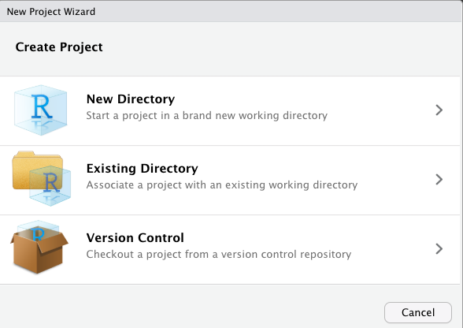
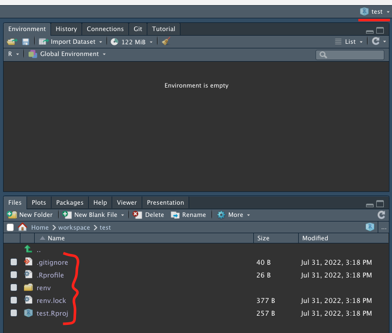
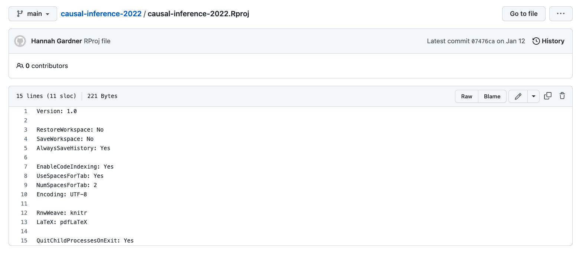

```{r, include = FALSE}
knitr::opts_chunk$set(
  collapse = TRUE,
  comment = "#>"
)
```

```{r setup, echo=F, message=F}
library(metrics.in.r)
library(here)
```

### Let's Start a New Project

The project picker is in the top-right corner of RStudio:


By clicking this dropdown, you can switch between projects or start a new one. Go ahead and click "New Project." You should see this dialog box pop up:



As you can see, there are multiple options when creating a new project. If you already have some code written in a folder, you can select "existing directory" to turn the folder into an R project. If you have a GitHub repository created, you can select "version control" to check out the project from git (see the article on git and GitHub for more info). If you're starting fresh, you can choose "new directory" to create a new folder. If you choose "new directory," the type of project you want to create is an R Project, and you probably want to check the boxes to create a git repository and use renv. I will cover both of these things in later articles.

<hr>

I created a project using the "New Directory" option and called it test. A screenshot of what my RStudio looked like afterwards is below. When you open a new project, you should see the RStudio window refresh, and you will have a "clean" instance of R. You environment tab will be empty, and your files tab will be open to wherever your project lives on your computer. The project picker will now show the name of your new project, and you should see one (or many) new files created. The most important file for right now is the `.Rproj` file that got created. We'll discuss this file next.



### What Actually *Is* an R Project?

The way that RStudio knows that your folder is an R project is because it has an `.Rproj` file. The file itself just stores some very minimal configuration. Here's an example `.Rproj` file from one of my projects on GitHub:



The configuration that is stored in these files is not very important. The importance is mainly that it signals to RStudio that *this folder is a project*. With that signal to RStudio come many benefits, described below. We touched on the first point already, and each of the subsequent points will be covered in depth in later articles.

* Whenever you open the project, you are greeted with a fresh clean RStudio window. I should note you can also open R projects by double-clicking on the `.Rproj` file itself.
* The `here` package looks for an `.Rproj` file and helps you easily locate all of your files *relative* to the folder that your `.Rproj` file is in.
* The RStudio Git tab is automatically activated inside of an R project, letting you sync your code with GitHub with the click of a button.
* The `renv` package "bootstraps" itself (starts itself up and starts running) when your project loads.

### What a "Fresh Clean Window" is Worth

Creating and using projects is part of a workflow that keeps you disciplined as a researcher. When you start fresh every time you open up RStudio, you are forced to write down your work in a file.

My philosophy on workflow is that RStudio is inherently an experimental thing. You can type code in the console, run it, inspect the output, and tinker with it until you are satisfied with the results. However, at that point, you need to WRITE IT DOWN in a file! Create a new R script and write down the exact commands from Step 1 to Step N, so that next time you open up a "fresh" RStudio window, you can click the "Source" button and your beautiful object will be replicated in your workspace just as it was before. This is the essence of reproducibility.

Toward that end, I recommend disabling the "Save workspace to .RData on exit" setting in RStudio. You can access this setting by clicking on the project picker and selecting "Project Options" at the bottom of the menu. Disabling this setting means that your workspace will be deleted every time you exit RStudio, and you cannot recover the variables that you were working with before. This is a good thing in my opinion, because it forces you to write everything down in scripts in such a way that you can always recover your work when you start a new session.

### Conclusion

This guide was sort of an overview of what projects look like in R. As you might have realized, part of the appeal of R projects is that they enable a lot of the other features that I will talk about in subsequent articles. The pattern that we want to start thinking about is that projects are isolated, reproducible environments. They not only contain code and data files, but also "meta information" that makes it possible for others to download your code and data and reproduce your results. 

Along those lines, we should love and revel in the fact that RStudio is a wonderful environment to tinker and experiment. However, we should also have the discipline to realize that eventually, we need to write down the concrete steps that produce the results we have.

<hr>

Happy coding!
