```{r, include = FALSE}
knitr::opts_chunk$set(
  collapse = TRUE,
  comment = "#>"
)
```

```{r setup, echo=F, message=F}
library(metrics.in.r)
library(here)
library(ggplot2)
library(broom)
```

## The Pattern

Like any intelligent person, you probably want to keep backups of your code handy in case your computer catches on fire and burns to a crisp. This is known broadly as "version control." By far the most widely used form of version control in the coding world is a program called git, and GitHub is a website where you can store your `git` projects. This article will walk you through how to get starting using `git` and GitHub for your own coding projects.

NOTE: There is a vast array of information available on `git` online since it is so popular. Oftentimes new programmers find the information intimidating! Don't let it scare you away from using `git` for your own projects. `git` is a program capable of supporting massive, complex projects, so it is naturally complex itself. You only need to use a small subset of functionality yourself, and I will try to highlight a workflow that should get you up and running relatively quickly.

## Some Definitions

First, let's define some terms relating to `git` and GitHub. `git` is a program that runs on the **command line**. GitHub is a website that stores `git` projects.


<div class="accordion accordion-flush" id="accordionFlushExample">
<div class="accordion-item">
<h3 class="accordion-header" id="flush-headingOne">
<button class="accordion-button collapsed" type="button" data-bs-toggle="collapse" data-bs-target="#flush-collapseOne" aria-expanded="false" aria-controls="flush-collapseOne">
<strong>Help!</strong>&nbsp;What's the command line?
</button>
</h3>
<div id="flush-collapseOne" class="accordion-collapse collapse" aria-labelledby="flush-headingOne" data-bs-parent="#accordionFlushExample">
<div class="accordion-body">
The command line is the OG computer. Before computers had mice and screens with graphics and things that you could click on, you interacted with computers via *text*. That is, you type a command into the computer, and it prints some text on the screen giving you the result of the command. The command line still exists even though we have mice and fancy screens with graphics and icons, because it can be helpful for programming. RStudio has a command line built into it. It is in the bottom left corner, called the "Terminal":
      
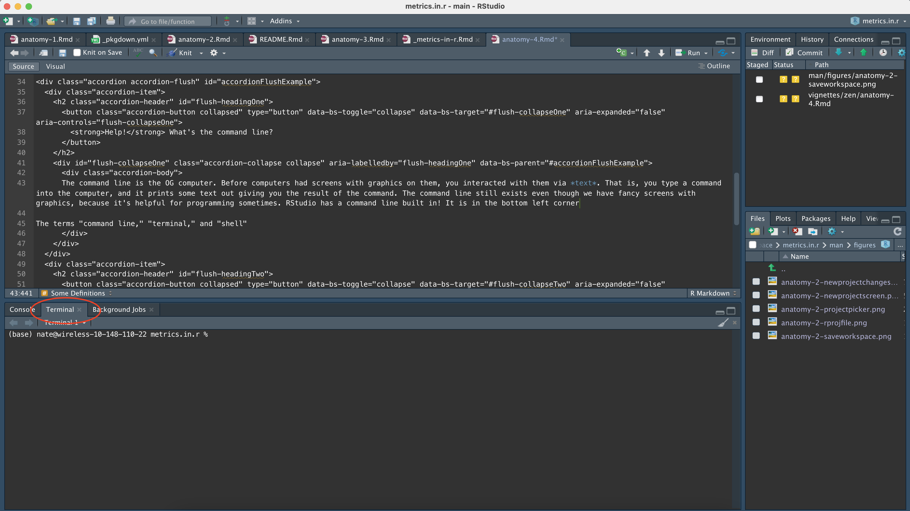
      
For the rest of the tutorial, whenever I say to enter something in the command line, I mean to type it here. I should also note that the terms "command line," "terminal," and "shell" are all generally used interchangeably, and I will use them interchangeably in this tutorial.

While I think that it is generally a good thing to know how to use the command line, there is definitely a learning curve that we can mostly avoid by using the point-and-click tools in RStudio. This article is one exception where we have to get our hands dirty with the command line, but I will try to minimize the command line usage as much as possible in general.
</div>
</div>
</div>
<div class="accordion-item">
<h3 class="accordion-header" id="flush-headingTwo">
<button class="accordion-button collapsed" type="button" data-bs-toggle="collapse" data-bs-target="#flush-collapseTwo" aria-expanded="false" aria-controls="flush-collapseTwo">
<strong>Go Deeper:</strong>&nbsp;What happens when you run something on the command line?
</button>
</h3>
<div id="flush-collapseTwo" class="accordion-collapse collapse" aria-labelledby="flush-headingTwo" data-bs-parent="#accordionFlushExample">
<div class="accordion-body">
What's interesting about commands in the terminal is that they are just files! There is a special type of file in operating systems called an executable file. The first word of the command you type in the terminal is the name of the file, and the rest of the words you type are given to the file as separate values called command arguments or simply "args."
      
As an example, one command that we will type in a second is `git push --set-upstream`. This means to run the `git` file, and run it with two args: `push` and `--set-upstream`. The command line finds the `git` file by looking somewhere called the PATH. Try typing this in your shell:
```{bash}
echo $PATH
```
This is all the folders your terminal will search for the executable file, in order, separated by colons. If you would like to see where the terminal found the `git` executable file, you can use the `which` command:
```{bash}
which git
```
Since R scripts are files, you might naturally wonder if you can run R scripts like this in the terminal. The answer is yes: see [this tutorial](https://riffomonas.org/code_club/2020-08-20-R-scripting) for some more explanation. I don't generally recommend doing this, since it can be confusing for others to understand what you're doing.
</div>
</div>
</div>
</div>

The `git` program does the actual business of creating backups of your code. You can make backups of any folder you choose on your computer. A `git` **repository** is one such folder that you are making backups of. For our purposes, that folder you are making backups of is *one* R project. So remember: *one R project = one `git` repository*.

GitHub is a website where you can store `git` repositories.  It is also called a **`git` remote**... because it saves your `git` repository in a remote place.

An individual "snapshot" or backup of your code with `git` is called a **commit**. A commit represents a small change to a few files in your code. You add messages to your commits to label them so you can remember what you changed in each commit. `git` stores a **diff** of the files in a commit, i.e. it only stores what changed in the files. That makes commits very lightweight in terms of storage space, so you are encouraged to make many commits to make it easier to keep track of your work. Commits represent a distinct unit of work that you have completed, for example a new feature, or a new dataset with an R script to clean it, or a set of edits to your paper/presentation.

It's important to remember that commits are only your local version of `git`. You eventually have to **push** to GitHub to copy your local backup to GitHub's servers. If you are working with other people, they will also push their work to the same GitHub repository. So you will have to **pull** their work from GitHub to your local computer to sync their changes, and you may possibly have to **merge** their changes with yours if there are any conflicts.

<hr>

In conclusion, your git/GitHub workflow looks like this: You make commits to take snapshots of your code, then you push to GitHub. If you're working with others, you periodically pull their changes from GitHub and merge them with your own. 

Merges can be a little bit complicated so I won't cover them here. When it comes time to learn about them, Google is your friend. There are also some other things in git/GitHub called branches and pull requests that you can look up if you are interested in learning more, but it's beyond the scope of this article. I digress: Let's get setup with `git` and GitHub and start using them!

## Get Everything Configured

Configuration is always the hard part. After we get everything setup it should be smooth sailing. The tools you need for this job are:

- The `git` command line program. This comes pre-installed on Mac and Linux computers, but not Windows. Windows users can download `git` from the `git` for Windows website [here](https://gitforwindows.org/).
- A GitHub account. Don't pick a stupid username like "nateybear" because you will be stuck with it forever 🙃 If you are a student, you get GitHub Pro for free. GitHub Pro allows you to create private repositories, which is great for storing your homework or other confidential/non-public things.
- The `gh` command line program. This is a command line program that allows you to configure your GitHub account to use with your local git, so that when you push to GitHub, GitHub knows who you are. Download the gh program [here](https://cli.github.com/).

### Easy as 1,2,...

#### 1. Login to GitHub

Type `gh auth login` into your terminal and hit enter. You will be asked a series of questions, which you can answer with the arrow keys and enter key. My answers to the questions are in blue:
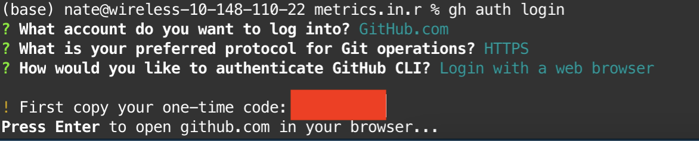

You will then be redirected to a web browser where you can login to GitHub and authorize your computer.

#### 2. Configure `git` to use GitHub credentials

Run `gh auth setup-git`. This tells `git` where to look for your login information for pushing to GitHub.

#### 3. Done

Surely it can't be that easy? Hopefully it is, sometimes it isn't. If you're my student, feel free to email me if you've having issues. To check that everything worked smoothly, run `git config --get github.user` to get the GitHub user that `git` is configured with, and make sure that your GitHub username is returned.


## Setup your project to use git/GitHub

There are two ways to start a project using `git` and GitHub. You can create the project on GitHub first and then download to your computer, or you can create the project locally on your computer first and then push to GitHub. I don't have an opinion on which is better, so I'll describe how to do both and you can pick the method that works for you.

### GitHub First

First, go to your GitHub page and make a new repository

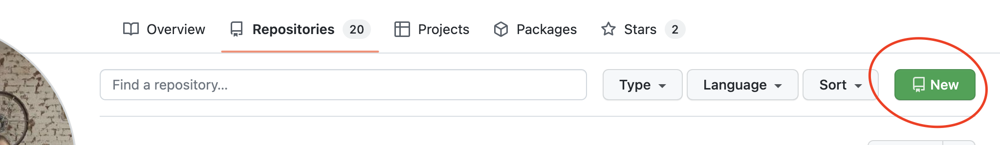

Pick a descriptive name for your repository. This is will be the name of your R project that is created. You can choose whether the repository is public or private, and you don't need to mess with any of the additional options[^1]. Go ahead and create the repository. You are taken to a screen with some information about how to clone your project. We want to copy the URL listed and use it later:

[^1]: For those who are curious: A .gitignore file tells `git` what *not* to track. RStudio provides us with a sensible one when we create a new project. The [choosealicense](https://choosealicense.com/) website can help you pick a software license for your project if you want one.

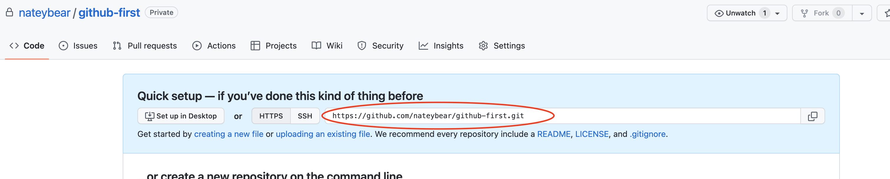

Now we create a new R project. Select "Version Control" as the type of project you want to create, and select "git" as the type of version control. Paste the URL to your GitHub project, make sure the project is created in the folder that you want (here I'm creating it in my "workspace" folder), and click "Create Project."

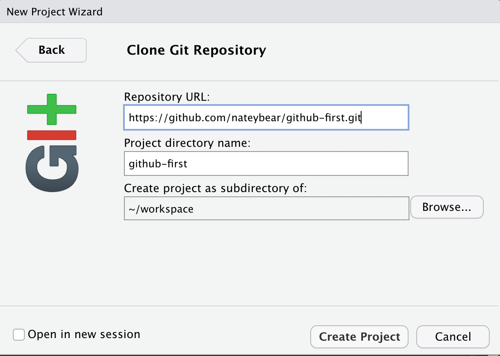

Now you have a new R project! You'll notice that RStudio created a few new files. Let's setup renv in our project and commit all of these new files and push to GitHub. The first thing is to run `renv::init()` to start using renv in the project:

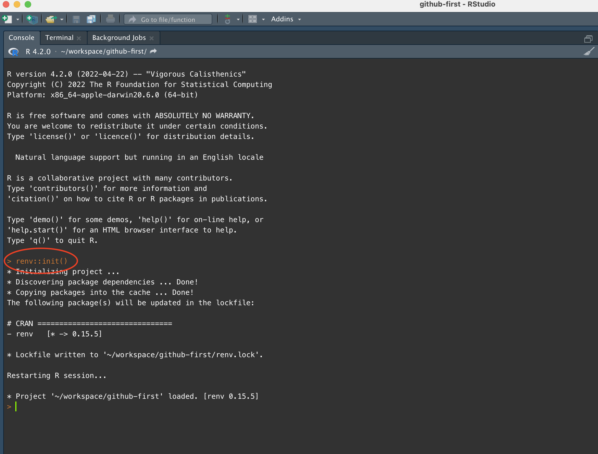

Now we navigate over to the `git` tab in the upper right corner of RStudio and we see a list of files. These are all of the changes that we have not yet committed. We want to add all of the files in one commit, so we check all of the boxes (aka "stage" all of the files) and click the commit button.

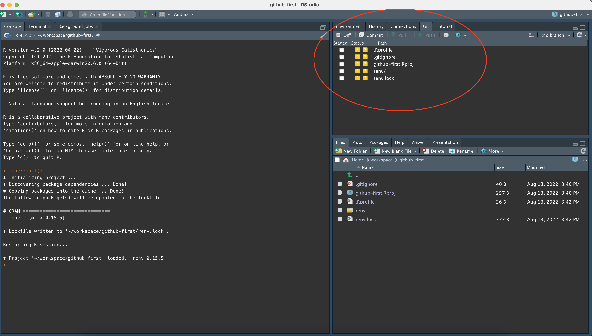
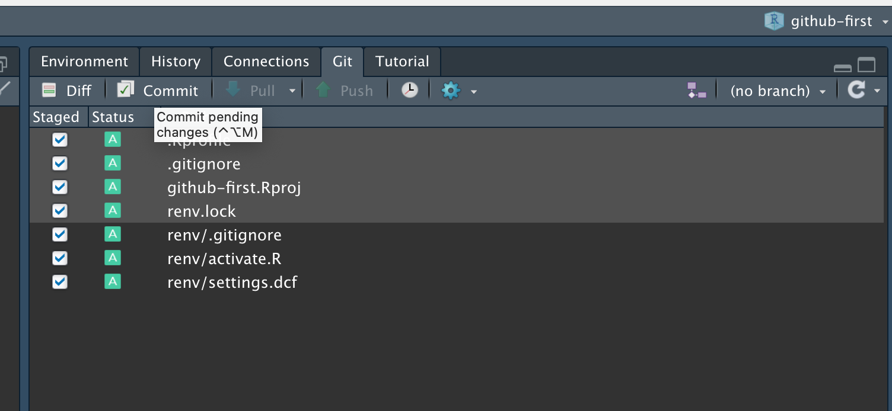

A new window pops up that let's us review what we are committing. On the left-hand side, we can click through all of the files that are being committed and see what has changed. On the right-hand side, we add a short message that describes the nature of the commit. For your first commit, it's fine to just write "initial commit." Click the "Commit" button right below the commit message, and congratulations! You have just made your first commit.

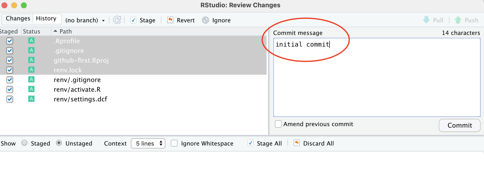

Remember that commits are just local. Now we have to push to GitHub to sync what is on the website and what we have on our computer. Thankfully it's as simple as clicking the green arrow to push. The blue arrow is to pull.

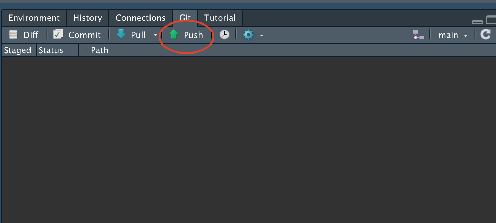

We have pushed to GitHub, so now we should be able to refresh our repository in our web browser and see the changes. You can see the most recent commit message in the screenshot below, and also the number of commits made.

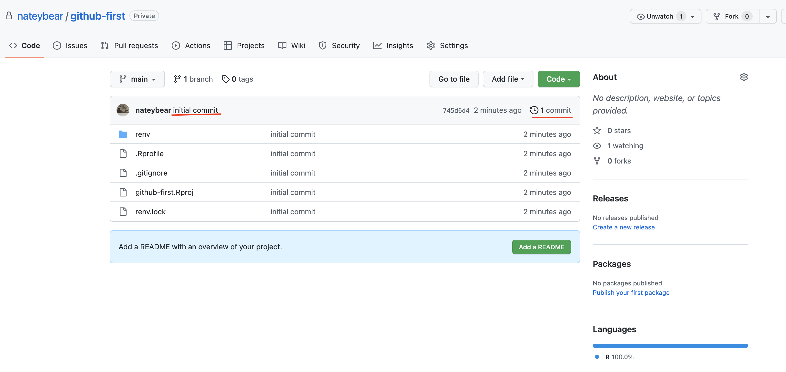

For the rest of your project, you follow the commit/push cycle we just did. Make some changes, select the changes in your `git` tab and click the commit button, make your commit and then click the push button. That's all there is to it!

### Local First

The first thing we do here is create a new project in RStudio, using `git` and renv:

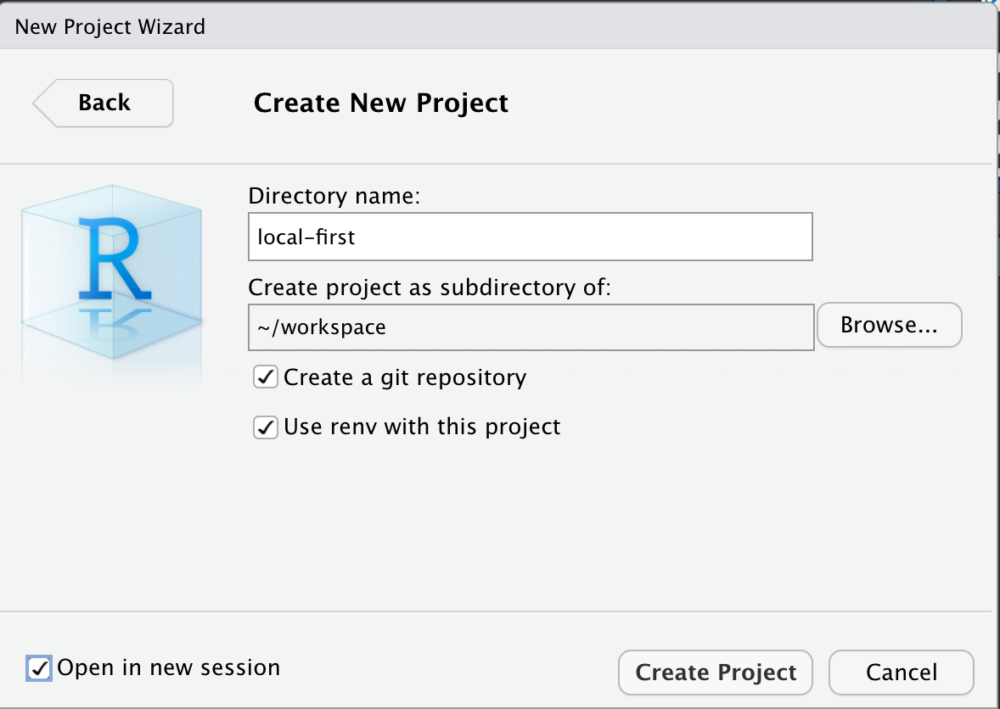

We have a new R project created, with all of the initial files we will need. Let's commit these as an "initial commit." This is the exact same procedure for the initial commit as we did in the GitHub First flow.

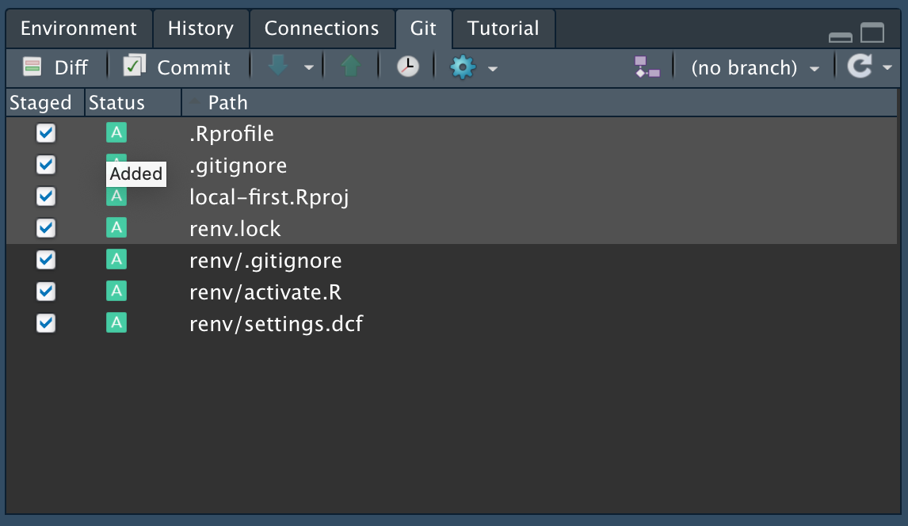

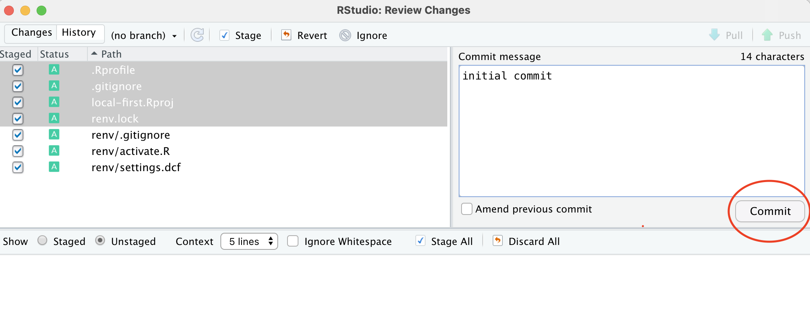

Now we have a process to commit in our R project, however we don't have a place to push our code to since the GitHub repository doesn't exist yet. Go into GitHub and create a new repository, and name it the same thing as you named your R project. (You don't _need_ to do that, but it would be kind of confusing otherwise!) 

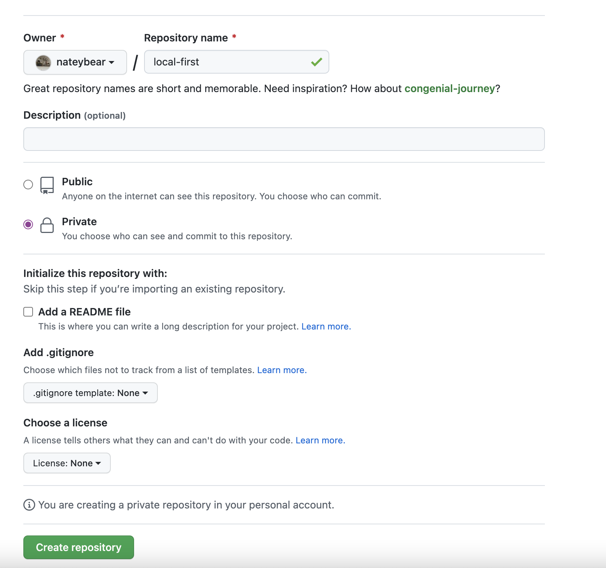

Once your respository is created, copy the URL for your project as we did in the GitHub first workflow. Now here's where we need to use the command line a little bit.

We need to use the command line because the `git` commands that we will run are slightly more advanced and are not something that we can do using the "point and click" interface in RStudio. The first command we need to run is `git remote add origin <GitHub URL>`. This tells `git` that we are adding a new remote repository for it to push to. We name the remote `origin` as a convention.

The second command that you run is `git push --set-upstream`. Because RStudio doesn't quite have enough information about where to push your code to, the first push needs to have some extra information (`--set-upstream`). This is a technical detail about branches, etc. The two commands should look like this:

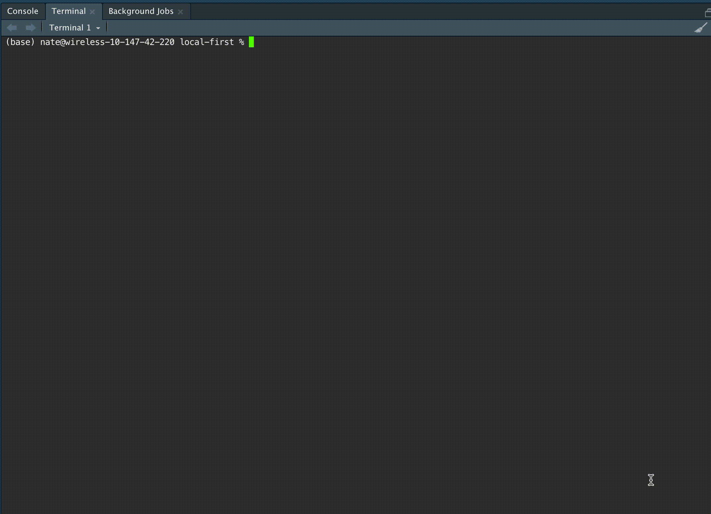

From here, you can resume the normal cycle of pushing code by clicking the green arrow in the RStudio `git` panel.

### Comparisons

The differences between the local-first and GitHub-first approaches to creating projects are fairly small, in the scheme of things. When you create your project in GitHub first, you have to manually setup `renv`. When you create your project locally first, you have to manually configure the GitHub repository you're pushing to. Once we get past these minor differences, the process is the exact same:

- Choose which files to commit by clicking the checkbox next to the file names in RStudio's `git` panel
- Click the Commit button and add a message describing what you've changed in this commit
- Click the green arrow to push your commit to GitHub

## Conclusions

This article may seem a little complicated, but remember two things:

1. There _is_ a learning curve to using `git`. You need to at least be familiar with the terminology before you can understand what all the buttons in RStudio mean. At the same time, the learning curve isn't _as_ big as it might seem. If you're comfortable with the language around committing, pushing, and pulling, then you are good to go.
2. This article is about configuration. Configuration is the hard part. When you get setup with `git` and are using it day-to-day, it's practically mindless. Day-to-day use is as simple as the three bullet points I listed above.

You can quickly venture into complex territory with `git`, but you can also stay at the surface level as we have done in this article and live a happy, stress-free life as a programmer. You may ask, "Why use `git` if it is so complicated?" and I would answer that inertia is a massive force in computer programming. Even if a superior alternative to `git` existed, it would take many years and a lot of concerted effort on the part of many people to make it a standard. For now, everyone uses `git` so we will too. Just stay out of the weeds and we can maintain our zenlike approach to programming. If you get in the weeds, find someone who knows more about `git` than you do to help you.

<hr/>

Happy Coding!